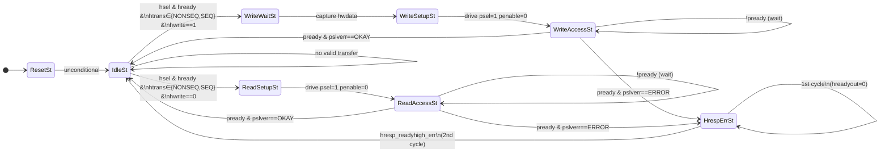

# AHB-Lite to APB Bridge

A synthesisable SystemVerilog implementation of an AMBA AHB-Lite to APB bridge.  
The bridge converts pipelined AHB-Lite transactions into the non-pipelined APB two-phase protocol.

---

## Table of Contents

1. [Overview](#overview)
2. [File Structure](#file-structure)
3. [Package Hierarchy](#package-hierarchy)
4. [System Block Diagram](#system-block-diagram)
5. [Package Reference](#package-reference)
   - [ahb\_to\_apb\_bridge\_common\_pkg](#ahb_to_apb_bridge_common_pkg)
   - [ahb\_pkg](#ahb_pkg)
   - [apb\_pkg](#apb_pkg)
6. [Module Interface](#module-interface)
7. [Internal Architecture](#internal-architecture)
8. [FSM State Machine](#fsm-state-machine)
9. [Transaction Flows](#transaction-flows)
   - [Write Transaction](#write-transaction)
   - [Read Transaction](#read-transaction)
   - [Error Response](#error-response)
10. [Signal Mapping](#signal-mapping)
11. [Write Strobe Generation](#write-strobe-generation)

---

## Overview

The AHB-to-APB bridge sits between a high-performance AHB-Lite bus and a bank of low-speed APB peripherals.

| Feature | Detail |
|---|---|
| AHB protocol | AHB-Lite (AMBA 3 / 5 subset) |
| APB protocol | APB4 (AMBA 4) |
| Data width | 32-bit (configurable via `DATA_WIDTH`) |
| Address width | 32-bit (configurable via `ADDR_WIDTH`) |
| Clock | Single synchronous clock |
| Reset | Active-low asynchronous reset (`rst_ni`) |
| FSM states | 8 |
| Pipelining | None (stalls AHB while APB completes) |

---

## File Structure

```
.
├── ahb_to_apb_bridge_common_pkg.sv   # Shared global parameters (ADDR_WIDTH, DATA_WIDTH)
├── ahb_pkg.sv                        # AHB-Lite type definitions (enums, structs, defaults)
├── apb_pkg.sv                        # APB4 type definitions (enums, structs, defaults)
└── ahb_to_apb_bridge_top.sv          # Bridge top-level module + FSM
```

---

## Package Hierarchy

The packages follow a strict import dependency order to avoid circular references.

```
┌──────────────────────────────────────────┐
│       ahb_to_apb_bridge_common_pkg       │
│  ─────────────────────────────────────   │
│  ADDR_WIDTH = 32                         │
│  DATA_WIDTH = 32                         │
└──────────┬───────────────────────┬───────┘
           │  import               │  import
           ▼                       ▼
    ┌─────────────┐        ┌─────────────┐
    │   ahb_pkg   │        │   apb_pkg   │
    └──────┬──────┘        └──────┬──────┘
           │  import               │  import
           └───────────┬───────────┘
                       ▼
          ┌────────────────────────┐
          │  ahb_to_apb_bridge_top │
          └────────────────────────┘
```

---

## System Block Diagram

```
          AHB-Lite Master
         (CPU / DMA / etc.)
               │
    ┌──────────▼──────────────────────────────────────────┐
    │               ahb_to_apb_bridge_top                 │
    │                                                     │
    │  ┌──────────────────────────────────────────────┐   │
    │  │              AHB Slave Port                  │   │
    │  │                                              │   │
    │  │  IN : hsel, hready, haddr, htrans, hburst,  │   │
    │  │       hsize, hwrite, hprot, hmastlock,       │   │
    │  │       hmaster, hwdata                        │   │
    │  │                                              │   │
    │  │  OUT: hrdata, hresp, hreadyout               │   │
    │  └────────────────────┬─────────────────────────┘   │
    │                       │                             │
    │  ┌────────────────────▼─────────────────────────┐   │
    │  │                   FSM                         │   │
    │  │                                              │   │
    │  │  ResetSt → IdleSt → WriteWaitSt             │   │
    │  │                   → WriteSetupSt            │   │
    │  │                   → WriteAccessSt           │   │
    │  │                   → ReadSetupSt             │   │
    │  │                   → ReadAccessSt            │   │
    │  │                   → HrespErrSt              │   │
    │  └────────────────────┬─────────────────────────┘   │
    │                       │                             │
    │  ┌────────────────────▼─────────────────────────┐   │
    │  │            Internal Registers                 │   │
    │  │  addr_q | wdata_q | rdata_q | strb_q | prot_q│   │
    │  └────────────────────┬─────────────────────────┘   │
    │                       │                             │
    │  ┌────────────────────▼─────────────────────────┐   │
    │  │              APB Master Port                 │   │
    │  │                                              │   │
    │  │  OUT: paddr, psel, penable, pwrite, pwdata,  │   │
    │  │       pprot, pstrb, pauser, pwakeup           │   │
    │  │                                              │   │
    │  │  IN : prdata, pready, pslverr                │   │
    │  └────────────────────┬─────────────────────────┘   │
    └───────────────────────┼─────────────────────────────┘
                            │
               ┌────────────▼────────────┐
               │      APB Peripheral     │
               │  (GPIO / UART / I2C...) │
               └─────────────────────────┘
```

---

## Package Reference

### `ahb_to_apb_bridge_common_pkg`

The root package. Defines the only two global parameters shared by both protocols.

| Parameter | Value | Description |
|---|---|---|
| `ADDR_WIDTH` | `32` | Address bus width in bits |
| `DATA_WIDTH` | `32` | Data bus width in bits |

---

### `ahb_pkg`

Defines all AHB-Lite types. Imports `ahb_to_apb_bridge_common_pkg`.

#### Enumerations

**`htrans_e` — Transfer Type (2-bit)**

| Name | Encoding | Description |
|---|---|---|
| `HTRANS_IDLE`   | `2'b00` | No transfer requested |
| `HTRANS_BUSY`   | `2'b01` | Master busy (insert wait during burst) |
| `HTRANS_NONSEQ` | `2'b10` | Single transfer or first beat of a burst |
| `HTRANS_SEQ`    | `2'b11` | Subsequent beats of a burst |

**`hburst_e` — Burst Type (3-bit)**

| Name | Encoding | Description |
|---|---|---|
| `HBURST_SINGLE` | `3'b000` | Single transfer |
| `HBURST_INCR`   | `3'b001` | Incrementing, undefined length |
| `HBURST_WRAP4`  | `3'b010` | 4-beat wrapping burst |
| `HBURST_INCR4`  | `3'b011` | 4-beat incrementing burst |
| `HBURST_WRAP8`  | `3'b100` | 8-beat wrapping burst |
| `HBURST_INCR8`  | `3'b101` | 8-beat incrementing burst |
| `HBURST_WRAP16` | `3'b110` | 16-beat wrapping burst |
| `HBURST_INCR16` | `3'b111` | 16-beat incrementing burst |

> **Note:** The bridge only handles single transfers. Burst support requires additional hardware.

**`ahb_hresp_e` — Response Type (1-bit)**

| Name | Encoding | Description |
|---|---|---|
| `HRESP_OKAY`  | `1'b0` | Transfer succeeded |
| `HRESP_ERROR` | `1'b1` | Transfer failed |

#### Structs

**`ahb_slave_req_t` — Master → Bridge**

```
┌─────────────────────────────────────────────────────┐
│ ahb_slave_req_t                                     │
├─────────────────┬───────┬──────────────────────────┤
│ Field           │ Width │ Description               │
├─────────────────┼───────┼──────────────────────────┤
│ hsel            │   1   │ Slave select              │
│ hready          │   1   │ Previous xfer complete    │
│ haddr           │  32   │ Transfer address          │
│ htrans          │   2   │ Transfer type (htrans_e)  │
│ hburst          │   3   │ Burst type (hburst_e)     │
│ hsize           │   3   │ Transfer size (bytes)     │
│ hwrite          │   1   │ 1=Write, 0=Read           │
│ hprot           │   4   │ Protection attributes     │
│ hmastlock       │   1   │ Locked transfer           │
│ hmaster         │   1   │ Master identifier         │
│ hwdata          │  32   │ Write data                │
└─────────────────┴───────┴──────────────────────────┘
```

**`ahb_slave_rsp_t` — Bridge → Master**

```
┌─────────────────────────────────────────────────────┐
│ ahb_slave_rsp_t                                     │
├─────────────────┬───────┬──────────────────────────┤
│ Field           │ Width │ Description               │
├─────────────────┼───────┼──────────────────────────┤
│ hrdata          │  32   │ Read data                 │
│ hresp           │   1   │ Response (hresp_e)        │
│ hreadyout       │   1   │ Slave ready               │
└─────────────────┴───────┴──────────────────────────┘
```

---

### `apb_pkg`

Defines all APB4 types. Imports `ahb_to_apb_bridge_common_pkg`.

#### Additional Parameters

| Parameter | Value | Description |
|---|---|---|
| `USER_REQ_WIDTH`  | `128` | Width of `pauser` field |
| `USER_RESP_WIDTH` | `16`  | Width of `pbuser` field |
| `USER_DATA_WIDTH` | `16`  | Width of `pwuser`/`pruser` (DATA_WIDTH/2) |

#### Enumerations

**`apb_resp_e` — APB Response (1-bit)**

| Name | Encoding | Description |
|---|---|---|
| `APB_OKAY`  | `1'b0` | Transfer completed successfully |
| `APB_ERROR` | `1'b1` | Transfer ended with error |

#### Structs

**`apb_req_t` — Bridge → APB Peripheral**

```
┌──────────────────────────────────────────────────────────┐
│ apb_req_t                                                │
├──────────────────┬─────────┬────────────────────────────┤
│ Field            │  Width  │ Description                │
├──────────────────┼─────────┼────────────────────────────┤
│ paddr            │   32    │ Transfer address           │
│ psel             │    1    │ Slave select               │
│ penable          │    1    │ Enables ACCESS phase       │
│ pwrite           │    1    │ 1=Write, 0=Read            │
│ pwdata           │   32    │ Write data                 │
│ pprot            │    3    │ Protection attributes      │
│ pstrb            │    4    │ Write byte strobes         │
│ pauser           │  128    │ User request sideband      │
│ pwuser           │   16    │ User write data sideband   │
│ pruser           │   16    │ User read data sideband    │
│ pbuser           │   16    │ User response sideband     │
│ pwakeup          │    1    │ Wakeup signal              │
└──────────────────┴─────────┴────────────────────────────┘
```

**`apb_rsp_t` — APB Peripheral → Bridge**

```
┌──────────────────────────────────────────────────────────┐
│ apb_rsp_t                                                │
├──────────────────┬─────────┬────────────────────────────┤
│ Field            │  Width  │ Description                │
├──────────────────┼─────────┼────────────────────────────┤
│ prdata           │   32    │ Read data from peripheral  │
│ pready           │    1    │ Peripheral ready           │
│ pslverr          │    1    │ Error response (apb_resp_e)│
└──────────────────┴─────────┴────────────────────────────┘
```

**APB Two-Phase Protocol**

```
Phase    PSEL   PENABLE   Description
──────   ────   ───────   ─────────────────────────────
IDLE      0       0       No transfer
SETUP     1       0       Address + control presented
ACCESS    1       1       Slave captures / drives data
```

---

## Module Interface

```
module ahb_to_apb_bridge_top (
    input  logic           clk_i,        // System clock
    input  logic           rst_ni,       // Active-low async reset

    //--- AHB Slave port (facing the AHB bus) ---
    input  ahb_slave_req_t ahb_i,        // AHB request from master
    output ahb_slave_rsp_t ahb_o,        // AHB response to master

    //--- APB Master port (facing the peripheral) ---
    input  apb_rsp_t       apb_i,        // APB response from peripheral
    output apb_req_t       apb_o,        // APB request to peripheral

    //--- Debug ---
    output logic           fsm_err_o     // Asserted if FSM hits default case
);
```

---

## Internal Architecture

### Registers

| Register | Width | Description |
|---|---|---|
| `addr_q`  | 32 | Latched AHB address (captured in IdleSt) |
| `wdata_q` | 32 | Latched AHB write data (captured in WriteWaitSt) |
| `rdata_q` | 32 | Latched APB read data (captured on successful ReadAccessSt) |
| `prot_q`  |  3 | Latched AHB protection bits → mapped to `pprot` |
| `strb_q`  |  4 | Write byte strobes derived from `HSIZE` + `HADDR` |
| `hresp_readyhigh_err` | 1 | Two-cycle AHB error response tracker |

### Byte Lane Calculation

For a 32-bit (4-byte) data bus:

```
BYTES    = DATA_WIDTH / 8 = 4
LSB_BITS = clog2(4)       = 2
lane     = haddr[1:0]           ← lower address bits select byte lane
```

---

## FSM State Machine

### State Definitions

| State | Encoding | Description |
|---|---|---|
| `ResetSt`      | `3'b000` | Post-reset; transitions immediately to Idle |
| `IdleSt`       | `3'b001` | Waits for a valid AHB NONSEQ/SEQ transfer |
| `WriteWaitSt`  | `3'b010` | Waits one cycle to capture `hwdata` (AHB data phase) |
| `WriteSetupSt` | `3'b011` | Asserts APB SETUP phase for write (`psel=1, penable=0`) |
| `WriteAccessSt`| `3'b100` | Asserts APB ACCESS phase for write (`psel=1, penable=1`) |
| `ReadSetupSt`  | `3'b101` | Asserts APB SETUP phase for read |
| `ReadAccessSt` | `3'b110` | Asserts APB ACCESS phase for read |
| `HrespErrSt`   | `3'b111` | Generates two-cycle AHB error response |

### State Transition Diagram



### FSM Truth Table

| Current State | Condition | Next State | AHB hreadyout | APB psel | APB penable |
|---|---|---|---|---|---|
| ResetSt | — | IdleSt | 1 | 0 | 0 |
| IdleSt | No valid xfer | IdleSt | 1 | 0 | 0 |
| IdleSt | Write request | WriteWaitSt | 0 | 0 | 0 |
| IdleSt | Read request | ReadSetupSt | 0 | 0 | 0 |
| WriteWaitSt | — | WriteSetupSt | 0 | 0 | 0 |
| WriteSetupSt | — | WriteAccessSt | 0 | 1 | 0 |
| WriteAccessSt | !pready | WriteAccessSt | 0 | 1 | 1 |
| WriteAccessSt | pready & OK | IdleSt | 1 | 0 | 0 |
| WriteAccessSt | pready & ERR | HrespErrSt | 0 | 0 | 0 |
| ReadSetupSt | — | ReadAccessSt | 0 | 1 | 0 |
| ReadAccessSt | !pready | ReadAccessSt | 0 | 1 | 1 |
| ReadAccessSt | pready & OK | IdleSt | 1 | 0 | 0 |
| ReadAccessSt | pready & ERR | HrespErrSt | 0 | 0 | 0 |
| HrespErrSt | 1st cycle | HrespErrSt | 0 | 0 | 0 |
| HrespErrSt | 2nd cycle | IdleSt | 1 | 0 | 0 |

---

## Transaction Flows

### Write Transaction

A write takes a minimum of **4 clock cycles**: IdleSt → WriteWaitSt → WriteSetupSt → WriteAccessSt → IdleSt.

```
Clock     ─┐  ┌─┐  ┌─┐  ┌─┐  ┌─┐  ┌─┐  ┌─
           └──┘  └──┘  └──┘  └──┘  └──┘  └──

CYCLE         C0       C1       C2       C3       C4

──────── AHB Bus (from Master) ──────────────────────────────────────────

HSEL      ──────────────────────────────────────
HREADY    ──────────────────────────────────────
HADDR     ──[  A  ]──────────────────────────────
HTRANS    ──[NONSEQ]─────────────────────────────
HWRITE    ──────────────────────────────────────  (HIGH)
HWDATA    ──────────[  D  ]──────────────────────  ← data phase, C1

HREADYOUT ──────────────────────────────[  1  ]──  ← bridge releases AHB
HRESP     ──[OKAY ]──────────────────────────────

──────── FSM State ───────────────────────────────────────────────────────

STATE     [IdleSt ][WriteWaitSt][WriteSetupSt][WriteAccessSt][  IdleSt ]

──────── APB Bus (to Peripheral) ────────────────────────────────────────

PADDR     ──────────────────────[    A    ]──[    A    ]──────────────────
PSEL      ──────────────────────[    1    ]──[    1    ]──────────────────
PENABLE   ────────────────────────────────────[    1    ]─────────────────
PWRITE    ──────────────────────[    1    ]──[    1    ]──────────────────
PWDATA    ──────────────────────[    D    ]──[    D    ]──────────────────
PSTRB     ──────────────────────[ strobe ]──[ strobe ]──────────────────
PREADY    ─────────────────────────────────────[  1  ]──────────────────  ← slave ack
PWAKEUP   ──────────────────────[    1    ]──[    1    ]──────────────────
```

**Step-by-step:**

1. **C0 — IdleSt:** AHB master asserts `hsel`, `hready`, `htrans=NONSEQ`, `hwrite=1`, `haddr=A`. Bridge latches address, computes `strb_q`, transitions to `WriteWaitSt`. Holds `hreadyout=0` to stall AHB.
2. **C1 — WriteWaitSt:** AHB presents write data on `hwdata`. Bridge latches into `wdata_q`. Transitions to `WriteSetupSt`.
3. **C2 — WriteSetupSt (APB SETUP):** Bridge drives `psel=1`, `penable=0`, `pwrite=1`, `paddr=A`, `pwdata=D`. Transitions to `WriteAccessSt`.
4. **C3 — WriteAccessSt (APB ACCESS):** Bridge drives `penable=1`. Waits for `pready`. On `pready=1` & `pslverr=OKAY`, returns `hreadyout=1` and goes to `IdleSt`.

---

### Read Transaction

A read takes a minimum of **3 clock cycles**: IdleSt → ReadSetupSt → ReadAccessSt → IdleSt.

```
Clock     ─┐  ┌─┐  ┌─┐  ┌─┐  ┌─┐  ┌─
           └──┘  └──┘  └──┘  └──┘  └──

CYCLE         C0       C1       C2       C3

──────── AHB Bus ────────────────────────────────────────────────────────

HSEL      ────────────────────────────────
HREADY    ────────────────────────────────
HADDR     ──[  A  ]────────────────────────
HTRANS    ──[NONSEQ]───────────────────────
HWRITE    ── (LOW / Read) ─────────────────

HREADYOUT ──────────────────────[  1  ]───  ← bridge releases AHB
HRDATA    ──────────────────────[  D  ]───  ← captured read data returned
HRESP     ──[OKAY]─────────────────────────

──────── FSM State ───────────────────────────────────────────────────────

STATE     [IdleSt ][ReadSetupSt][ReadAccessSt][  IdleSt  ]

──────── APB Bus ────────────────────────────────────────────────────────

PADDR     ───────────[    A    ]──[    A    ]────────────
PSEL      ───────────[    1    ]──[    1    ]────────────
PENABLE   ─────────────────────────[    1    ]───────────
PWRITE    ─────────────── (LOW) ────────────────────────
PREADY    ──────────────────────────[  1  ]─────────────  ← slave ack
PRDATA    ──────────────────────────[  D  ]─────────────  ← read data
```

**Step-by-step:**

1. **C0 — IdleSt:** AHB master presents read address. Bridge latches `addr_q`, transitions to `ReadSetupSt`.
2. **C1 — ReadSetupSt (APB SETUP):** Bridge drives `psel=1`, `penable=0`, `pwrite=0`. Transitions to `ReadAccessSt`.
3. **C2 — ReadAccessSt (APB ACCESS):** Bridge drives `penable=1`. On `pready=1` & `pslverr=OKAY`, latches `rdata_q = prdata`, asserts `hreadyout=1`, returns to `IdleSt`. Read data flows to `hrdata` from `rdata_q`.

---

### Error Response

When APB returns `pslverr=ERROR` (on either a read or write access), the bridge must generate a **two-cycle AHB error response** as required by the AHB specification.

```
CYCLE       Cx (ACCESS)    Cx+1 (ERR cycle 1)    Cx+2 (ERR cycle 2)

STATE      [WriteAccessSt] [  HrespErrSt      ]  [  HrespErrSt      ] → IdleSt

PREADY     ────[  1  ]──────────────────────────────────────────────
PSLVERR    ────[ERROR]──────────────────────────────────────────────

HREADYOUT  ────────────────[      0      ]────── [      1      ]────
HRESP      ────────────────[    ERROR    ]────── [    ERROR    ]────
```

- **Cycle 1 (HrespErrSt, first visit):** `hreadyout=0`, `hresp=ERROR`. `hresp_err_d` is set.
- **Cycle 2 (HrespErrSt, second visit):** `hresp_readyhigh_err=1` (registered), `hreadyout=1`, `hresp=ERROR`. FSM returns to `IdleSt`.

---

## Signal Mapping

### AHB `hprot` → APB `pprot`

The AHB4 `hprot[3:0]` and APB4 `pprot[2:0]` protection attributes are different encodings. The bridge maps them as follows:

| APB pprot bit | Source | AHB hprot bit | Meaning |
|---|---|---|---|
| `pprot[0]` | ← | `hprot[1]` | Privileged (1) / Unprivileged (0) |
| `pprot[1]` | — | — | Secure/Non-secure (not driven, stays 0) |
| `pprot[2]` | ← | `hprot[0]` | Data (0) / Instruction (1) access |

```systemverilog
apb_o.pprot[0] = prot_q[1];   // Privileged
apb_o.pprot[2] = prot_q[0];   // Instruction/Data
// pprot[1] left at default 0 (Secure)
```

---

## Write Strobe Generation

The write byte strobes (`pstrb`) are computed from `HSIZE` (transfer size) and `HADDR[1:0]` (byte lane) during the `IdleSt` phase and stored in `strb_q`.

For `DATA_WIDTH=32` (BYTES=4, LSB_BITS=2):

```
lane = haddr[1:0]
```

| HSIZE | Access | Strobe Logic | Example lane=0 | Example lane=1 | Example lane=2 | Example lane=3 |
|---|---|---|---|---|---|---|
| `3'b000` | Byte (1B)     | `4'b0001 << lane`         | `4'b0001` | `4'b0010` | `4'b0100` | `4'b1000` |
| `3'b001` | Halfword (2B) | `4'b0011 << (lane & ~1)`  | `4'b0011` | `4'b0011` | `4'b1100` | `4'b1100` |
| `3'b010` | Word (4B)     | `4'b1111 << (lane & ~2)`  | `4'b1111` | `4'b1111` | `4'b1111` | `4'b1111` |
| default  | —             | `4'b0000`                 | — | — | — | — |

The `& ~1` / `& ~2` masking aligns the strobe to natural halfword/word boundaries even if the raw lane value is unaligned.

---

## Design Considerations

**Why WriteWaitSt exists:**
AHB is a pipelined protocol. The address phase and data phase are offset by one cycle — `hwdata` is only valid one cycle after `haddr`. `WriteWaitSt` absorbs this pipeline offset before launching the APB transaction.

**Why AHB is stalled:**
APB is non-pipelined. The bridge cannot accept a new AHB transfer until the current APB transaction completes. `hreadyout=0` is held through the entire APB sequence to stall the AHB master.

**Two-cycle error response:**
The AHB spec requires that `HRESP=ERROR` be held for two consecutive cycles, with `HREADY=0` on the first and `HREADY=1` on the second. `HrespErrSt` implements this via the one-cycle delayed `hresp_readyhigh_err` register.

**`fsm_err_o` debug port:**
The default branch of the FSM case statement asserts `fsm_err_o`. Under correct operation this should never fire. Connect it to a sticky error register or assertion during simulation.
